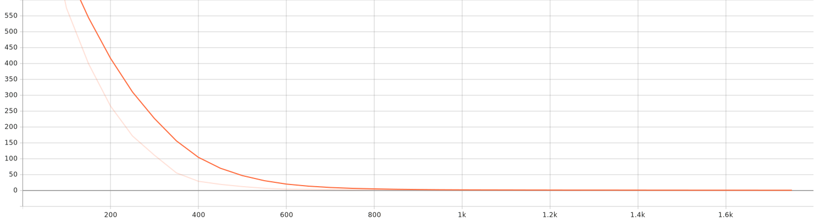

# Speech-to-Text + Voice Intensity (Multi-Task Whisper)

An end-to-end project that **transcribes speech** and **predicts voice intensity** (loudness) **simultaneously** using a multi‑task head on top of Whisper’s encoder. Includes:

- ✅ Multi-task training (ASR + intensity regression head)
- ✅ Evaluation on validation & test (WER + intensity RMSE)
- ✅ A baseline intensity regressor for comparison
- ✅ An interactive Gradio app for demo
- ✅ Dockerfile, Makefile, and clean repo structure

> Intensity target can be **RMS in dBFS** (simple, robust) or **LUFS** (perceived loudness, ITU-R BS.1770) via `pyloudnorm`.

---
## 🚀 Model on Hugging Face

[](https://huggingface.co/Amirhossein75/speech-intensity-whisper)

<p align="center">
  <a href="https://huggingface.co/Amirhossein75/speech-intensity-whisper">
    
  </a>
</p>

---

## Repo Structure

```
speech-intensity-multitask/
├─ app/
│  └─ app.py                        # Gradio app for inference/demo
├─ scripts/
├─ src/
│  ├─ baseline/
│  │  └─ baseline_intensity_regressor.py
│  ├─ models/
│  │  └─ multitask_whisper.py       # Whisper + regression head
│  ├─ evaluate.py                   # Evaluate a checkpoint on test split
│  ├─ inference.py                  # CLI inference on a single audio file
│  └─ train_multitask_whisper.py    # Train + validate + test
├─ sagemaker/
│  ├─ inference/
│     ├─ deploy_endpoint.py      # create & deploy a SageMaker endpoint (real-time or serverless)
│     ├─ invoke.py               # send an audio file to the endpoint and print JSON result
│     ├─ inference.py            # model load + request/response handling on the endpoint
│     └─ requirements.txt        # inference-time Python deps for the endpoint container
│  ├─ train/
│     ├─ train_entry.py          # entry point that calls src/train_multitask_whisper.py
│     ├─ train_sm.py             # launch a SageMaker training job (HuggingFace Estimator)   
│     └─requirements-train.txt   # extra audio/metrics deps for training
├─ .gitignore
├─ Dockerfile
├─ LICENSE
├─ Makefile
└─ requirements.txt
```

---

## Quickstart

> Python 3.10+ recommended. If you have a GPU, ensure a matching PyTorch + CUDA wheel is installed.

```bash
pip install -r requirements.txt
```

### Train (LibriSpeech clean-100)
```bash
python src/train_multitask_whisper.py \
  --model_id openai/whisper-small \
  --dataset librispeech --librispeech_config clean \
  --train_split train.100 --eval_split validation --test_split test \
  --language en --intensity_method rms \
  --epochs 3 --batch_size 8 --grad_accum 2 --lr 1e-5 --fp16 \
  --output_dir ./checkpoints/mtl_whisper_small
```

### Evaluate on Test
```bash
python src/evaluate.py \
  --ckpt ./checkpoints/mtl_whisper_small \
  --dataset librispeech --language en --intensity_method rms
```

### Baseline Intensity Regressor
```bash
python src/baseline/baseline_intensity_regressor.py \
  --dataset librispeech --language en --intensity rms
```

### Run the App
```bash
CHECKPOINT=./checkpoints/mtl_whisper_small python app/app.py
```
Then open the printed Gradio URL. Upload a `.wav`/`.flac` and see the transcript + intensity.

---

## Datasets

Two easy options via 🤗 Datasets:
- **LibriSpeech** (`openslr/librispeech_asr`): use `"clean"` config, `train.100`, `validation`, `test` splits (English).
- **Common Voice** (`mozilla-foundation/common_voice_11_0`): multilingual; set `--language` (e.g., `en`, `hi`).

We compute intensity targets directly from audio (RMS dBFS or LUFS).

---

## Model

`WhisperForASRAndIntensity` extends `WhisperForConditionalGeneration` by attaching a small **regression head** on the **encoder’s mean‑pooled last hidden state**. Training minimizes:

```
total_loss = asr_ce_loss + λ * mse(intensity)
```

- Units: dBFS for RMS, or LUFS for perceived loudness.
- Set λ via `--lambda_intensity` (default `1.0`).

---

##  📊 Results & Metrics

### 🔎 Highlights
- **Test WER (↓):** **4.6976**
- **Test Intensity RMSE (↓):** **0.7334**
- **Validation WER (↓):** 4.6973 • **Validation Intensity RMSE (↓):** 1.4492

> Lower is better (↓). WER computed with `jiwer`. Intensity RMSE is the regression error on the loudness target (RMS dBFS by default, or LUFS if `--intensity_method lufs` is used).

---

### ✅ Full Metrics

#### Validation (Dev)
| Metric | Value |
|---|---|
| **Loss** | **2.2288** |
| **WER (↓)** | **4.6973** |
| **Intensity RMSE (↓)** | **1.4492** |
| **Runtime (s)** | **1,156.757**  _(≈ 19m 17s)_ |
| **Samples / s** | **2.337** |
| **Steps / s** | **0.292** |
| **Epoch** | **1** |

#### Test
| Metric | Value |
|---|---|
| **Loss** | **0.6631** |
| **WER (↓)** | **4.6976** |
| **Intensity RMSE (↓)** | **0.7334** |
| **Runtime (s)** | **1,129.272**  _(≈ 18m 49s)_ |
| **Samples / s** | **2.320** |
| **Steps / s** | **0.290** |
| **Epoch** | **1** |

#### Training Summary
| Metric | Value |
|---|---|
| **Train Loss** | **72.5232** |
| **Runtime (s)** | **6,115.966**  _(≈ 1h 41m 56s)_ |
| **Samples / s** | **4.666** |
| **Steps / s** | **0.292** |
| **Epochs** | **1** |

---

### ℹ️ Notes
- **ASR quality** is reported as **WER** via `jiwer.wer` on post‑processed, lower‑cased transcripts.  
- **Intensity target** is computed per‑sample using **RMS dBFS** (clipped to [-60, 0] dB) by default, or **LUFS** (clipped to [-70, 0] LUFS) when `--intensity_method lufs` is used.  
- Generation used `task="transcribe"` and language as configured in the script, with forced decoder prompt IDs when available.

<details>
<summary><strong>Raw metrics (for reproducibility)</strong></summary>

```json
{
  "validation": {
    "eval_loss": 2.228771209716797,
    "eval_wer": 4.69732730414323,
    "eval_intensity_rmse": 1.4492216110229492,
    "eval_runtime": 1156.7567,
    "eval_samples_per_second": 2.337,
    "eval_steps_per_second": 0.292,
    "epoch": 1.0
  },
  "training": {
    "train_loss": 72.52319664163974,
    "train_runtime": 6115.9656,
    "train_samples_per_second": 4.666,
    "train_steps_per_second": 0.292,
    "epoch": 1.0
  },
  "test": {
    "test_loss": 0.6630592346191406,
    "test_wer": 4.69758064516129,
    "test_intensity_rmse": 0.7333692312240601,
    "test_runtime": 1129.2724,
    "test_samples_per_second": 2.32,
    "test_steps_per_second": 0.29,
    "epoch": 1.0
  }
}
```

</details>

The training script validates each epoch and computes **test** metrics at the end.
 you can download the finetuned weights for one epoch from [here](https://drive.google.com/file/d/1qpk4aJihiLKb2f3yioPu8qb4byyBViWw/view?usp=sharing)
you can check the logs of training in [training-test-logs](training-test-logs)

## ⚙️ Training Hyperparameters
By default, the script uses the [CMU ARCTIC dataset](http://festvox.org/cmu_arctic/) with **AWB → CLB** as the voice conversion pair.
**Outputs**
- A standard Hugging Face model folder in `--output_dir` (config + weights + tokenizer files).
- Use this folder as `--checkpoint` in the local demos.

| **Category**     | **Parameter**            | **Default Value**      | **Description**                              |
| ---------------- | ------------------------ | ---------------------- | -------------------------------------------- |
| **Model**        | `model_id`               | `openai/whisper-small` | Base Whisper checkpoint                      |
|                  | `lambda_intensity`       | `1.0`                  | Loss weight for intensity regression head    |
| **Dataset**      | `dataset`                | `librispeech`          | Options: `librispeech`, `common_voice`       |
|                  | `librispeech_config`     | `clean`                | LibriSpeech subset (`clean` / `other`)       |
|                  | `train_split`            | `train.100`            | Training split                               |
|                  | `eval_split`             | `validation`           | Validation split                             |
|                  | `test_split`             | `test`                 | Test split                                   |
|                  | `language`               | `en`                   | Language code (also used for Common Voice)   |
|                  | `intensity_method`       | `rms`                  | Options: `rms` (dBFS, −60→0), `lufs` (−70→0) |
| **Training**     | `epochs`                 | `1`                    | Number of epochs                             |
|                  | `batch_size`             | `8`                    | Per-device train/eval batch size             |
|                  | `grad_accum`             | `2`                    | Gradient accumulation steps                  |
|                  | `lr`                     | `1e-5`                 | Learning rate                                |
|                  | `seed`                   | `42`                   | Random seed                                  |
|                  | `fp16`                   | `False`                | Mixed precision training if enabled          |
| **Trainer Args** | `evaluation_strategy`    | `epoch`                | Evaluate at each epoch                       |
|                  | `save_strategy`          | `epoch`                | Save checkpoint each epoch                   |
|                  | `predict_with_generate`  | `True`                 | Generate text during eval                    |
|                  | `logging_steps`          | `50`                   | Steps between log outputs                    |
|                  | `report_to`              | `tensorboard`          | Logging backend                              |
|                  | `load_best_model_at_end` | `True`                 | Restore best checkpoint                      |
|                  | `metric_for_best_model`  | `eval_wer`             | Best model selected by WER                   |
|                  | `greater_is_better`      | `False`                | WER minimized                                |
|                  | `remove_unused_columns`  | `False`                | Keep custom collator inputs                  |
| **Decoding**     | `max_new_tokens`         | `225`                  | Max tokens when generating                   |
|                  | `forced_decoder_ids`     | auto                   | Forced prompt IDs for stable decoding        |
| **Metrics**      | `wer`                    | computed via `jiwer`   | Word Error Rate (↓ better)                   |
|                  | `intensity_rmse`         | computed               | Root Mean Squared Error of loudness          |

### 📉 Loss Curve

The following plot shows the training loss progression:



*(SVG file generated during training(by tensorboard logs) and stored under `assets/`)*

## 🖥️ Training Hardware & Environment

- **Device:** Laptop (Windows, WDDM driver model)  
- **GPU:** NVIDIA GeForce **RTX 3080 Ti Laptop GPU** (16 GB VRAM)  
- **Driver:** **576.52**  
- **CUDA (driver):** **12.9**  
- **PyTorch:** **2.8.0+cu129**  
- **CUDA available:** ✅ 


## 📊 Training Logs & Metrics

- **Total FLOPs (training):** `8,260,304,304,527,639,000`  
- **Training runtime:** `6,115.9658` seconds  
- **Logging:** TensorBoard-compatible logs in `src/checkpoint/logs`  

You can monitor training live with:

```bash
tensorboard --logdir src/checkpoint/log
```


## SageMaker Deployment (real‑time endpoint)

Deploy the multi-task Whisper model as a **SageMaker** endpoint and serve transcript + intensity.

### 0) Train or download a checkpoint
Train via `src/train_multitask_whisper.py` (see earlier sections), or use the sample weights the repo links (one epoch) and place them under `./checkpoints/mtl_whisper_small`. See “The training script validates each epoch…” in README for details.  [repo README] 

### 1) Deploy

```bash
pip install "sagemaker>=2.250.0" boto3
python sagemaker/inference/deploy_endpoint.py \
  --bucket YOUR_S3_BUCKET \
  --ckpt_dir ./checkpoints/mtl_whisper_small \
  --role_arn arn:aws:iam::<acct>:role/<SageMakerExecutionRole> \
  --endpoint_name s2t-intensity-whisper \
  --instance_type ml.g5.xlarge   # or use --serverless
  


```
### 2) Invoke
```bash
python sagemaker/inference/invoke.py --endpoint_name s2t-intensity-whisper --audio path/to/sample.wav
# => {"transcript": "...", "intensity_dbfs": -17.2}
```
---
## Sagemaker Training

You can now train the model on **Amazon SageMaker** using the Hugging Face Deep Learning Containers (DLCs), while reusing the existing `src/train_multitask_whisper.py` script.

### For more info regarding sagemaker usage go  [here](sagemaker/train) 
### Getting Started :
1. **Install dependencies**

```bash
   pip install "sagemaker>=2.140.0" "boto3"
```

2. **Launch a SageMaker training job from your repo root**

```bash
python sagemaker/train_sm.py \
  --role-arn arn:aws:iam::<account-id>:role/<SageMakerExecutionRole> \
  --bucket <your-s3-bucket> \
  --region <aws-region> \
  --instance-type ml.g5.2xlarge \
  --job-name whisper-intensity-train \
  --model-id openai/whisper-small \
  --dataset librispeech --librispeech-config clean \
  --train-split train.100 --eval-split validation \
  --language en --intensity-method rms \
  --epochs 3 --batch-size 8 --grad-accum 2 \
  --lr 1e-5 --fp16 true \
  --use-spot true
```
* This script:
* Creates a HuggingFace Estimator with your repo as source_dir.
* Runs the training inside a Hugging Face container.
* Executes train_entry.py, which calls your original training script and writes output to /opt/ml/model.
* Automatically uploads results as model.tar.gz to S3.
* Saves cost by using spot instances and checkpoint S3 URIs (if enabled)
## Notes & Tips

- Whisper expects **16 kHz** audio features; resampling is handled automatically.
- LUFS requires `pyloudnorm` (optional, recommended for perceptual alignment).
- If you want **human‑annotated intensity/arousal**, consider datasets like MSP‑Podcast or CREMA‑D (adapt labels & licensing accordingly).

---
## License

MIT
